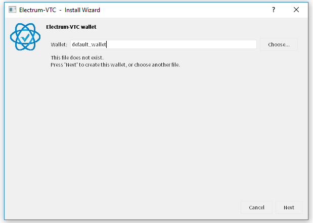
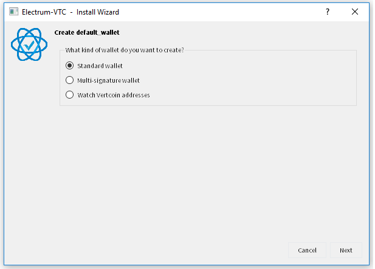
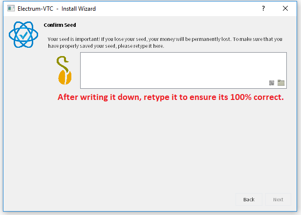
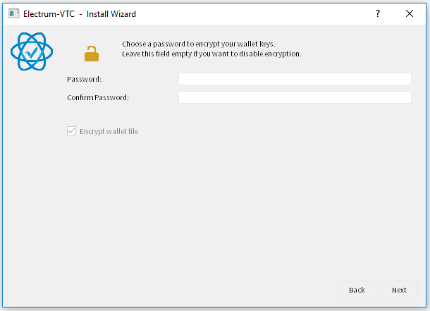

# Electrum Wallet for Vertcoin

The [Vertcoin Electrum Wallet (Electrum-VTC)](https://github.com/vertcoin/electrum-vtc) is a lightweight wallet which does not require you to download the blockchain data onto your computer (unlike the [Core Wallet](https://github.com/vertcoin/vertcoin)). Instead, it relies on a server-client protocol which means that there is a server somewhere that provides the blockchain information to you on demand. Electrum is first released on 2011 for Bitcoin ([wiki](https://en.bitcoin.it/wiki/Electrum)), but has proven itself sufficiently to be adapted for use by many other cryptocurrencies. 

###[PSA: Do not mine to Electrum Wallet! (reddit link)](https://www.reddit.com/r/vertcoin/comments/7ix2jn/do_not_mine_to_a_ledger_or_electrum_wallet_use/)

If you are mining, **DO NOT** mine to Electrum-VTC. Use the [Core Wallet (download link)](https://github.com/vertcoin/vertcoin/releases) instead - the reason being, mining generates a lot of small payments (dust payments) and Electrum-VTC is written with Python, which does not handle all these transactions that well compared to the Core Wallet. Also, since it relies on external servers (which anyone can host), if there is too much volume from mining transactions and the servers get overloaded your transactions will be very very slow to process.

That said, lets get started with Electrum-VTC!

## Getting Started

The guide will include the following series of steps:

1. Installing Electrum-VTC
2. ​

### Installation 

To start, navigate to the [Vertcoin-Electrum's Github releases page](https://github.com/vertcoin/electrum-vtc/releases) and download the appropriate version for your computer's Operating System. You may notice that there are two different files that look the same:

Either version works; the difference being:

**Installer Version:** Creates files/folders in your PC's windows directories.

**Portable Version:** Creates file/folders in the directory the .exe file is located - benefits of this is that you can carry it on a USB Drive/Portable HDD.

Security wise, both versions are equal. One added risk for the portable version may be present IF you choose to use the USB drive on just other computers which may not be secure or are infected with malware.

Once you double click on your downloaded Electrum-VTC.exe file it should open up to this screen:

Put whatever name you fancy there, and press `Next` to see the next screen:

In this guide, we will focus on Standard wallet. Select standard wallet and click `Next`. You will see this screen:

*Note: A multi-signature wallet is a wallet that requires 2 or more signatures before funds can be released. Useful when you have a joint account with someone else, or when you want to make your funds even more difficult for any potential attackers to steal. You can read more about this in the [Electrum.org Documentation](http://docs.electrum.org/en/latest/multisig.html).*

Select `Create a new seed` and click `Next` and you will see 12 words - these are your seed keys a.k.a private keys. **WRITE THESE DOWN AND KEEP THEM SOMEWHERE SAFE!** If someone gets them, they get all your funds.

Click `Next`, and you will be prompted to re-enter your seed keys. Look back at your paper and type it in!

Once that is done, you will be asked to key in your password. This password will be used whenever you wish to send your funds out from the wallet.

Once you see this screen below - you're ready to go! As long as the bottom right of the UI shows a green color indicating that it is connected to the servers, you can basically start sending/receiving coins. 

*Note: Its probably a good idea to try and send a small amount to test before sending the rest!*

### Using Electrum-VTC (Sending, receiving, monitoring transactions, sweeping private keys)

#### Sending Vertcoins 

Using Electrum-VTC is easy - 

####Receiving Payment

To receive payment (Electrum-VTC is for VTC only!) in VTC, you'll need to have an address.

Click on the Receive Tab on the Left side, and then ...

#### Monitoring transactions

